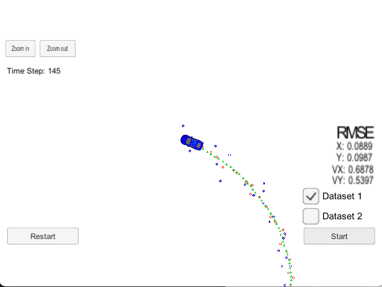

# Extended Kalman Filter and Sensor Fusion in Perception

The goal of this project is to utilize the Kalman filter and extended Kalman filter (EKF) to estimate the state of a bicycle moving around the car with noisy lidar and radar measurements.

## Build and Launch

This project involves the Term 2 Simulator, which can be downloaded [here](https://github.com/udacity/self-driving-car-sim/releases). Once the install for [uWebSocketIO](https://github.com/uWebSockets/uWebSockets) is complete, the main program can be built and run by doing the following from the project top directory.

```sh
mkdir build
cd build
cmake ..
make
./ExtendedKF
```

## Results

In the following image, lidar measurements are red circles, and radar measurements are blue circles with an arrow pointing in the direction of the observed angle. The green triangles are estimations given by the Kalman filter and extended Kalman filters. 



We can clearly see that the radar measurements have poorer resolution compared with the lidar measurements. The blue car-shaped object here is a little misleading and actually represents the bicycle that moves around the car.

A linear motion model is used for the bicycle. Thus, the prediction step is linear for both the Kalman filter and the EKF. However, the update step is different for the two filters. The lidar measurement model is linear and applies the standard Kalman filter, while the radar measurement is nonlinear and applies the EKF. The two kinds of measurements are fused together based on the timestamps using sensor fusion.

[The video here](https://youtu.be/E2RPJFtib5Q) clearly shows that the filters (see the green markers) successfully detects the location of the moving bicycle.


